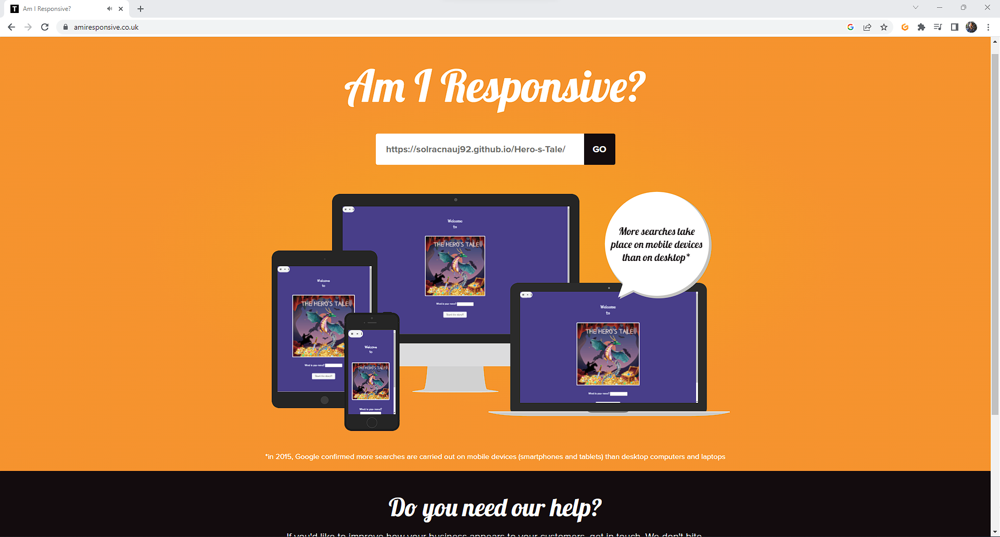

# The Hero's Tale 

[View live project here on GitHub](https://solracnauj92.github.io/Hero-s-Tale/)

The Hero's Tale is an interactive fantasy tale website with a Choose Your Own Adventure game. The website gives the reader the option to decide how the story will develop and, ultimately, finish at different points in the narrative. The story can be concluded in any of three different ways. The reader has control over it. Basically it allows players to make decisions and choose their own path through the story, creating a personalised and unique experience for people of all ages.
  
   
  

---

## CONTENTS  
  
* [UXD (User Experience Design)](#user-experience-ux)
  * [User Stories](#user-stories) 
* [Creation process (Strategy -> Surface)](#creation-process)
  * [Wireframes](#wireframes)
* [Design](#design)
  * [Colour Scheme](#color-scheme)
  * [Typography](#typography)
  * [Imagery](#imagery)
* [Page Features](#page-features)
  * [Navbar](#navbar)
  * [Hero-Image](#hero-image)
  * [Tagline & Call to Action](#tagline--call-to-action)
  * [Business Ethos](#business-ethos)
  * [Menu Page](#menu-page)
  * [Contact Page](#contact-page)
  * [Footer](#footer)  
* [Tablet & Mobile View](#tablet--mobile-view)
  * [Desktop, Tablet & Mobile Differences](#desktop-tablet--mobile-differences)
  * [Tablet View](#tablet-view-ipad-miniipad-prosurface-pro)
  * [Mobile View](#mobile-view-iphone-5iphone-seiphone-xriphone-12-pro)
* [Future Features](#future-features)
* [Technologies Used](#technologies-used)
  * [Languages Used](#languages-used)
  * [Frameworks, Libraries, Technologies & Programs Used](#frameworks-libraries-technologies--programs-used)
* [Deployment](#deployment)
  * [How to deploy](#how-to-deploy)
* [Testing](#testing)
  * [HTML Validation using W3C Validation](#html-validation-using-w3c-validation)
  * [CSS Validation using W3C Validation](#css-validation-using-w3c-validation)
  * [Lighthouse scores via Chrome Developer Tools](#lighthouse-scores-via-chrome-developer-tools)
  * [Bugs & Fixes](#bugs--fixes)
  * [Unsolved Bugs](#unsolved-bugs)
* [Credits](#credits) 
 
---    

## User Experience (UX)  
  
### **User Stories**  

### **Goal**  
  
Visitors to the website may come there for reasons other than finishing the quest, such as to take in the fascinating and engaging story that puts them in control of the outcome. To  provide players a chance to escape reality and experience various scenarios. The game intends to serve as a sort of escapism plus visitors can test and develop their decision-making abilities by making choices and then seeing the results of those actions.

 
### **First Time Visitor**

The first-time visitor's goal is to finish the quest. Regardless of how the story ends, they will still need to make the proper decisions to get there. The visitor is free to repeat the game as much as they like,  It provides a new experience each time they are played.

### **Returning Visitor**

A return visitor's goal is to take a different route to the finish. to uncover what might have followed if they had selected alternatives to their initial responses. Once again, They are free to repeat the game as much as they like.

  
### **Frequent Visitor**  

As Frequent visitors, they would frequently check to see whether the narrative had been updated, or one could simply wish to re-experience the game again on their own or with their friends or families.   

--- 

## Creation Process  
  
### **1. Developing a story**  

As I was researching, I understood what was required to build a story. Plus, I had played and read a number of books with a similar theme. It was clear I needed a straightforward yet well-organised game with obvious goals, obstacles, and outcomes to increase interaction and engagement.
The story would take several different turns, with each turn resulting in a different outcome.

I ended by choosing the Dragons and dungeons theme as they are the classic elements of fantasy and adventure stories, making them a natural fit for a “Choose Your Own Adventure” game. Players can explore fantastical environments and encounter mythical creatures, adding excitement and intrigue to the game. Plus, Dungeons are often filled with danger and mystery, providing opportunities for players to make decisions that affect their outcome. This can add tension and suspense to the game, keeping players engaged and invested in the story.

  

### **2. World building**  

Wrote out the text for each part of the story, including descriptions of the scene, characters, and actions. I made sure to include the decisions that the player will make and the consequences that follow. 

  

### **3. Targets**  

This game is designed to be easy to play and understand, making them accessible for people of all ages, including children and older adults. Plus it’s a game that can be highly engaging, as players must make decisions and solve problems in order to progress through the story. This can keep players of all ages invested and interested in the game.  

  
### **4. Wireframes & Navigation**  

A wireframe was executed  to plan and organise the content and functionality of a website, making it easier to design and build the site. Keeping in mind the user experience and ensuring that the website is easy to navigate and use. Plus determine the user interface and navigation for the game, including how the player will make decisions and how they will be taken to the next part of the story.
 

---   
  
  
## Design  

### **Color Palette**  

Here is the colour palette, however the main colour purple was chosen as it is often associated with royalty, luxury, and mystery. It is also often associated with magic, mysticism, and the unknown, which can help to create a sense of mystery and awe around the dragon, making it feel more magical and otherworldly.  
  
  
  
  
### **Typography**  
  
[Google Fonts](https://fonts.google.com/) The following text font was chosen for the entire website. Using this font in  an interactive game enhances the overall style, making the game more approachable, and with personality.   
  

        
### **Images**  
  
All Images and graphics were created via Canva. I have taken the time to design every scene cover to ensure that the website gives an interactive and narrative feel to it. [Canva](https://www.canva.com/)

 

### **Audio** 

Added audio as an interactive element to enhance the player's experience.

 

---  
    

## Desktop, Tablet & Mobile View  
 
### **Desktop, Tablet & Mobile Differences**  
  
This website is optimised for different sizes and devices, so that players can access the game from any device with ease.

### **Desktop View (Chrome/Opera/Microsoft Edge)**  
  

  
### **Tablet View (Chrome/Opera/Microsoft Edge)**  
  

### **Mobile View (Chrome/Opera/Microsoft Edge)**  
  

---  
                              
## Future Features  

-Possible new story branching or continuing the story 

-Allowing players to save their progress and pick up from where they left. This would make it easier for them to continue their adventure and not repeat it. 

-Update overall look and designs and add interactive elements to make the experience more immersive

-Keep track of the choices players make throughout the game, allowing them to see the consequences of their actions and make more informed decisions.

-Add social sharing functionality, allowing players to share their progress and choices with friends, creating a sense of community around the game.

-Implement analytics to track player behaviour and gather data, which can be used to make improvements to the game and create a better experience for players.
  
---   
  
## Technologies Used    

- HTML
    - HTML is used to structure and use Bootstrap components by adding specific classes.
- CSS
    - CSS is used to style and personalise Bootstrap components used for the website
- [Bootstrap v5.3](https://getbootstrap.com/docs/5.3/getting-started/introduction/)
    - bootstrap was used for html home page.
- Google Fonts
        - [Poor Story, by Yoon Design](https://fonts.google.com/specimen/Poor+Story)
- [Figma](https://www.figma.com)
    - The wireframe and the world building was pre-planned and designed via Figma. 
- [Canva](https://www.canva.com/)
    - Canva was used for: 
      - Granting copyright free graphics
      - Designing and testing visuals 
- [Coolors](https://coolors.co/)
    - Generated the brand colour palatte
- [QuillBot](https://quillbot.com/)
    - QuillBot was used scan writings and alert any errors in grammar, spelling, punctuation as well as rephrase any research used for the website
- [ChatGPT](https://openai.com/blog/chatgpt/)
    - This was used inform a summary of a topic
- GitHub 
    - Stores, manages, and track changes to the project code
- Chrome DevTools
    - Chrome DevTools helped to debug, inspect, test the website's responsive design and check performance analysis tools
- [Am I responsive](https://ui.dev/amiresponsive)
    - Mock up and check responsiveness across different devices 

---   
 
## Deployment

### **How to deploy**  

GitHub was used to deploy the website. These were the steps taken to acheive this:  

1. Login to GitHub account
2. Navigate to the project repository
3. Click the Settings button near the top of the page
4. In the left-hand menu, find and click on the Pages button
5. In the Source section, choose 'main' from the drop-down, select branch menu
6. Select 'root' from the drop-down folder menu
7. Click 'Save' and after a few moments the project will have been made live and a link is visible at the top of the page

---  
    
## Testing  

This website was designed to be usable and readable on all screen sizes.
  
### **Testing**    

Testing took place throughout the entire build using Dev Tools on Chrome and on the above real-world devices. The browsers used were:  
- Chrome  
- Opera  
- Edge  
   
### **HTML Validation using W3C Validation**  

Index/landing page HTML validation
  

   

Menu page HTML validation
  

  

Contact page HTML validation
  

  
  
   

### **CSS Validation using W3C Validation** 

SCOOPS CSS validation
  

   

   

### **Lighthouse scores via Chrome Developer Tools**   
  
For Desktop   

Lighthouse audit for Index page
  

 

Lighthouse audit for Menu page
  

Lighthouse audit for Contact page
  

      

 
  
For Mobile   

Lighthouse audit for Index page - Mobile
  

 

Lighthouse audit for Menu page - Mobile
  

Lighthouse audit for Contact page - Mobile
  

      
   
### **Bugs & Fixes**  
  
Images were not responsive, I styled them in css sheets.
The javascript extension was giving me errors; I deleted it and restored it, and the errors updated and vanished.

### **Unsolved Bugs** 

Applied bootstrap to html but it doesn’t apply to the rest
Unable to style font size from js 

---  

## Credits  
  
### **Content References**
- All content written for the website is by myself, is purely fictional, and for educational purposes only.
- [Code Institute](https://codeinstitute.net/ie/) for their HTML/CSS learning material and 'content zoom' module in the Love Running project.
- [W3Schools](https://www.w3schools.com/) for additional learning material.
- [MDN Web Docs](https://developer.mozilla.org/en-US/docs/Learn/CSS/CSS_layout/Flexbox) for flexbox tutorials and guidance.
- [dev.to](https://dev.to/snkds/how-to-create-striped-backgrounds-with-css-5dfn) for the CSS diagonal stripes tutorial.
- Alan from Code Institute Tutor Support for helping me with an element width issue in my media queries.
- [StackOverflow](https://stackoverflow.com/questions/66564503/wrong-validation-on-element-br-in-ul-li-elements) guidance on removing br element from menu li items to improve semantic HTML
- [Browserstack](https://www.browserstack.com/guide/what-are-css-and-media-query-breakpoints#:~:text=Essentially%2C%20media%20query%20breakpoints%20are,offers%20an%20optimal%20user%20experience.) for media queries and breakpoints guidance.
- [Elaine Broche](https://github.com/elainebroche-dev/ms1-thrive) Design inspired by Elaine's striking juice website.
- [Kera Cudmore - Creating your First README](https://github.com/kera-cudmore/readme-examples) for README structure and Markdown guidance. 
  

### **Acknowledgements** 
- I would like to acknowledge my Code Institute mentor, Rahul Lakhanpal, for his guidance and encouragement on this project.
- My family for testing my work and offering positive thoughts and hot cups of tea throughout the project.
