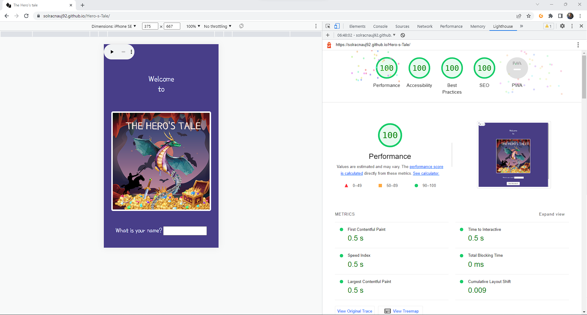
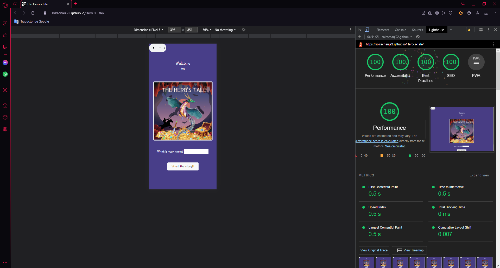
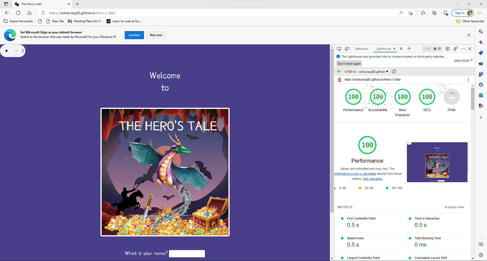
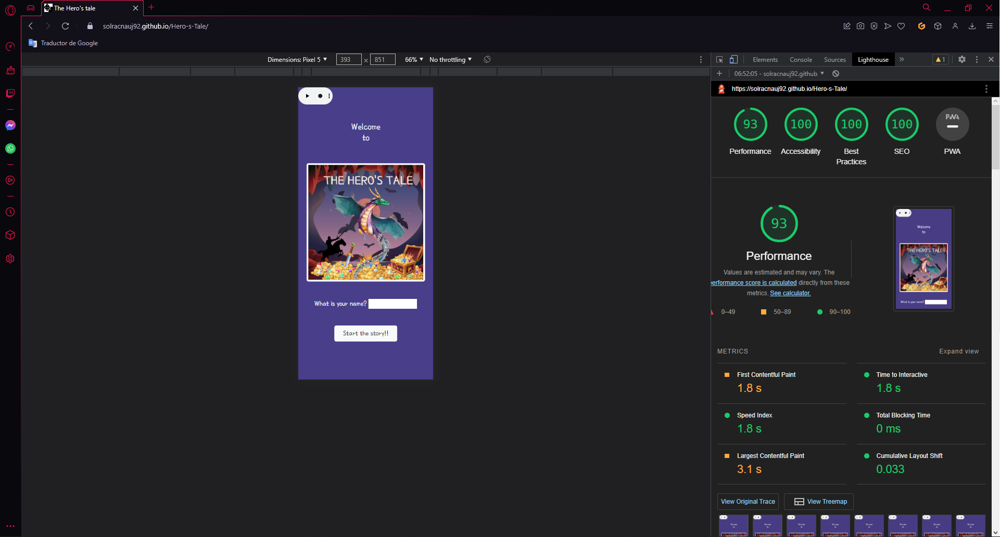
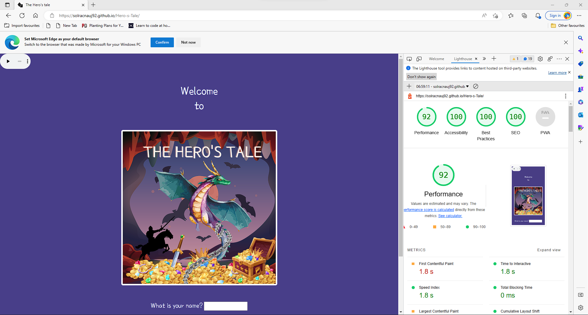

# The Hero's Tale 

[View live project here on GitHub](https://solracnauj92.github.io/Hero-s-Tale/)

I'm thrilled to introduce "Hero's Tale," a Choose Your Own Adventure website created using Javascript, forming a significant part of Portfolio Project 2.

## Intro & Inspiration

Growing up, my love for games led me to learn coding with dreams of joining the game industry. Excitingly, this passion project came along – "The Hero's Tale," a choose-your-own-adventure game. Inspired by the adventure books I devoured growing up, it's a nod to childhood joy and a journey into the gaming world! 

With my background in gaming, strategy, and storytelling, I'm crafting this interactive fantasy on a website. 
You get to call the shots—there are three different endings, and it's all up to you. 
I want everyone of all ages to have fun with their own unique journey through this game.

   

# [Content](#content)
  - [Intro & Inspiration](#intro-inspiration)
  - [User Experience - UX](#user-experience---ux)
     - [Aim](#aims)
     - [Target](#target)
     - [User Personas](#personas)
     - [User goals](#goals)
     - [First Time Visitor](#first-time-visitor)
     - [Returning Visitor](#returning-visitor)
     - [Frequent Visitor](#frequent-visitor)
 - [Creation Process](#creation-process)
    - [Developing Story](#developing-story)
    - [World Building](#world-building)
    - [Story Structure for Javascript](#story-structure)
 - [Wireframe](#wireframe)
    - [Desktop](#desktop)
    - [Tablet](#tablet)
    - [Mobile](#mobile)
    - [Features & Responsiveness](#features)
    -[Future Features](#future-features)
- [Design & Media](#design)
    - [Colour Palette](#colour-palette)
    - [Typography](#typography)
    - [Images](#images)
    - [Audio](#audio)
 - [Audits](#audits)
      - [HTML Validation](#html-validation)
      - [CSS Validation](#css-validation)
      - [Javascript Validation](#javascript-validation)
      - [Feedback](#feedback)
      - [Bugs & Fixes](#bugs-fixes)
 - [Deployment](#deployment)
      - [How to Deploy](#how-to-deploy)
      - [Cloning and Forking](#cloning-forking)
  - [Technologies Used](#testing)
  - [Credits](#credits)
      - [Acknowledgement](#acknowledgement)

-----

# User Experience - UX

## Aim 

- **Interactive Storytelling:** Engage with an immersive fantasy narrative where your decisions steer the course of the tale.
- **Multiple Endings:** Explore different storylines and experience varied conclusions based on your choices.
- **JavaScript-Based:** Developed primarily using JavaScript, ensuring a dynamic and responsive user experience.
- **User-Friendly Interface:** Simple and intuitive design for easy navigation and enjoyment for users of all ages.

## Target

- **Provide Entertainment:** Offering an engaging and enjoyable experience through interactive storytelling.
- **Stimulate Imagination:** Encouraging users to visualise and engage with a rich fantasy world.
- **Empower Decision-Making:** Allowing users to shape their own adventure, emphasising the significance of choices.
- **Deliver Personalised Experiences:** Creating unique narratives tailored to each user's decisions and preferences.

## User Persona 

 ### Tech Enthusiast Sarah:

Background: Sarah is a tech enthusiast and coding novice eager to explore creative coding projects. She's interested in simple and engaging projects to improve her coding skills.
 
Goals: Learn coding basics, have fun with interactive projects, and gain hands-on experience.

### Busy Parent Alex:

Background: Alex is a busy parent with limited time for recreational activities. Looking for games that offer a quick, enjoyable escape, Alex values simplicity and engaging content.
 
Goals: Find a game that provides a brief, entertaining experience during short breaks or downtime.

### Gaming Veteran Jordan:

Background: Jordan is a seasoned gamer with a love for complex narratives and decision-based games. Seeking a new and immersive experience, Jordan appreciates games that challenge strategic thinking.
 
Goals: Explore a unique, narrative-driven game that offers multiple story paths and challenges decision-making skills.

## **Goal**  
  
Visitors to the website may come there for reasons other than finishing the quest, such as to take in the fascinating and engaging story that puts them in control of the outcome. To  provide players a chance to escape reality and experience various scenarios. The game intends to serve as a sort of escapism plus visitors can test and develop their decision-making abilities by making choices and then seeing the results of those actions.

 
### **First Time Visitor**

The first-time visitor's goal is to finish the quest. Regardless of how the story ends, they will still need to make the proper decisions to get there. The visitor is free to repeat the game as much as they like,  It provides a new experience each time they are played.

### **Returning Visitor**

A return visitor's goal is to take a different route to the finish. to uncover what might have followed if they had selected alternatives to their initial responses. Once again, They are free to repeat the game as much as they like.

  
### **Frequent Visitor**  

As Frequent visitors, they would frequently check to see whether the narrative had been updated, or one could simply wish to re-experience the game again on their own or with their friends or families.   

--- 

# Creation Process  
  
## Developing a story

As I was researching, I understood what was required to build a story. Plus, I had played and read a number of books with a similar theme. It was clear I needed a straightforward yet well-organised game with obvious goals, obstacles, and outcomes to increase interaction and engagement.
The story would take several different turns, with each turn resulting in a different outcome.

I ended by choosing the Dragons and dungeons theme as they are the classic elements of fantasy and adventure stories, making them a natural fit for a “Choose Your Own Adventure” game. Players can explore fantastical environments and encounter mythical creatures, adding excitement and intrigue to the game. Plus, Dungeons are often filled with danger and mystery, providing opportunities for players to make decisions that affect their outcome. This can add tension and suspense to the game, keeping players engaged and invested in the story.

  

## World building

Wrote out the text for each part of the story, including descriptions of the scene, characters, and actions. I made sure to include the decisions that the player will make and the consequences that follow. 

  

### Story structure for Javascript

The Hero's Tale is organised into distinct scenes, each representing a chapter or significant point in the narrative. The structure follows a simple format for ease of understanding and modification.

- Scenes
Each scene is defined as an object with the following properties:

- Title: Describes the title of the scene.
- Story: Contains the narrative content, including dynamic elements if necessary (e.g., player's name).
- Image: Refers to an image associated with the scene, enhancing the visual experience.
- Alt: Provides alternative text for accessibility purposes.
- Choices: Represents an array of choices available to the player. Each choice consists of a label and a destination, indicating the next scene.

#### Example 

  
### **4. Wireframes & Navigation**  

A wireframe was executed  to plan and organise the content and functionality of a website, making it easier to design and build the site. Keeping in mind the user experience and ensuring that the website is easy to navigate and use. Plus determine the user interface and navigation for the game, including how the player will make decisions and how they will be taken to the next part of the story.
 

---   
  
  
## Design  

### **Color Palette**  

Here is the colour palette, however the main colour purple was chosen as it is often associated with royalty, luxury, and mystery. It is also often associated with magic, mysticism, and the unknown, which can help to create a sense of mystery and awe around the dragon, making it feel more magical and otherworldly.  
  
  
  
  
### **Typography**  
  
[Google Fonts](https://fonts.google.com/) The following text font was chosen for the entire website. Using this font in  an interactive game enhances the overall style, making the game more approachable, and with personality.   
  

        
### **Images**  
  
All Images and graphics were created via Canva. I have taken the time to design every scene cover to ensure that the website gives an interactive and narrative feel to it. [Canva](https://www.canva.com/)

 

### **Audio** 

Added audio as an interactive element to enhance the player's experience.

[Royalty Free Music by Benjamin Tissot](https://www.bensound.com/royalty-free-music/track/birth-of-a-hero/) 

---  
    

## Desktop & Mobile View  
 
### **Desktop & Mobile Differences**  

  
This website is optimised for different sizes and devices, so that players can access the game from any device with ease.

### **Desktop View (Chrome/Opera/Microsoft Edge)**  
  

### **Mobile View (Chrome/Opera/Microsoft Edge)**  
  

---  
                              
## Future Features  

-Possible new story branching or continuing the story 

-Allowing players to save their progress and pick up from where they left. This would make it easier for them to continue their adventure and not repeat it. 

-Update overall look and designs and add interactive elements to make the experience more immersive

-Keep track of the choices players make throughout the game, allowing them to see the consequences of their actions and make more informed decisions.

-Add social sharing functionality, allowing players to share their progress and choices with friends, creating a sense of community around the game.

-Implement analytics to track player behaviour and gather data, which can be used to make improvements to the game and create a better experience for players.
  
---   
  
## Technologies Used    

- HTML
    - HTML is used to structure and use Bootstrap components by adding specific classes.
- CSS
    - CSS is used to style and personalise Bootstrap components used for the website
- [Bootstrap v5.3](https://getbootstrap.com/docs/5.3/getting-started/introduction/)
    - bootstrap was used for html home page.
- Google Fonts
        - [Poor Story, by Yoon Design](https://fonts.google.com/specimen/Poor+Story)
- [Figma](https://www.figma.com)
    - The wireframe and the world building was pre-planned and designed via Figma. 
- [Canva](https://www.canva.com/)
    - Canva was used for: 
      - Granting copyright free graphics
      - Designing and testing visuals 
- [Coolors](https://coolors.co/)
    - Generated the brand colour palatte
- [QuillBot](https://quillbot.com/)
    - QuillBot was used scan writings and alert any errors in grammar, spelling, punctuation as well as rephrase any research used for the website
- [ChatGPT](https://openai.com/blog/chatgpt/)
    - This was used inform a summary of a topic
- GitHub 
    - Stores, manages, and track changes to the project code
- Chrome DevTools
    - Chrome DevTools helped to debug, inspect, test the website's responsive design and check performance analysis tools
- [Am I responsive](https://ui.dev/amiresponsive)
    - Mock up and check responsiveness across different devices 

---   
 
## Deployment

### **How to deploy**  

GitHub was used to deploy the website. These were the steps taken to acheive this:  

1. Login to GitHub account
2. Navigate to the project repository
3. Click the Settings button near the top of the page
4. In the left-hand menu, find and click on the Pages button
5. In the Source section, choose 'main' from the drop-down, select branch menu
6. Select 'root' from the drop-down folder menu
7. Click 'Save' and after a few moments the project will have been made live and a link is visible at the top of the page

---  
    
## Testing  

This website was designed to be usable and readable on all screen sizes.
  
### **Testing**    

Testing took place throughout the entire build using Dev Tools on Chrome and on the above real-world devices. The browsers used were:  
- Chrome  
- Opera  
- Edge  
   
### **HTML Validation using W3C Validation**  

HTML validation
  

  

   

### **CSS Validation using W3C Validation** 

CSS validation
  

   

   

### **Javascript Validation using jshint**  

Javascript validation
  

    
   
### **Bugs & Fixes**  
  
Images were not responsive, I styled them in css sheets.
The javascript extension was giving me errors; I deleted it and restored it, and the errors updated and vanished.

### **Unsolved Bugs** 

Applied bootstrap to html but it doesn’t apply to the rest
Unable to style font size from js 

---  

## Credits  
  
### **Content References**
- All content written for the website is by myself, is purely fictional, and for educational purposes only.
- [Code Institute](https://codeinstitute.net/ie/) 
- [W3Schools](https://www.w3schools.com/) 
- [StackOverflow](https://stackoverflow.com/)
- [@KevinBriggs](https://www.youtube.com/@kevinbriggs8354)
- [WebDevSimplified](https://www.youtube.com/@WebDevSimplified/)
- [BrittanyCodes](https://www.youtube.com/@brittany-codes6772)
- [Fontawesome](https://fontawesome.com/)

 
  

### **Acknowledgements** 
- I would like to acknowledge my Code Institute mentor, Can Sücüllü, for his guidance and encouragement on this project.
- My wife for her huge support throughout the project and her colleague Richey.
